# Design Log
## profiling
### pandas profiling을 사용
> 10000개의 dataset을 가지고 검사를 했을 때 정확했으며 data civilizer를 구축하는데 필요한 profile 항목들이 들어있음. 결과적으로는 profiler를 구축하는데 걸리는 시간을 줄일 수 있음.
## Column유사성 계산
#### profile에 있는 데이터 빈도수를 바탕으로 (겹치는 데이터에서 작은 빈도수)/(전체 데이터의 합집합)으로 계산.
## IND
#### (칼럼간 교집합)/(FK 테이블의 칼럼 집합-중복 제거) == 1일 경우 PK에서 FK로의 IND가 성립
## GraphDB: Arango db
#### 파이썬 라이브러리 존재, 코드 공개 필요없는 라이센스.
> 네오포제이는 라이센스(bsd||apache||mit만 가능) 때문에 탈락, orient db는 디비 연결이 안되는 에러가 발생하여 진행 불가

## 함수 설계
```python
1. Make DataBase & Polystore
	A. Function makedb(char db, char file_name)
	- db connect (host, user, password, db)
	- csv 파일 읽어 db에 insert
	B. Function polystore(char db)
	- 필요한 데이터 select
	- DataFrame 형식으로 변환
2. Cleanliness
	A. Function get_iqr (list data)
	- q1, q3구해 -> iqr 구함
	- 최소,최대 넘어가는 값들 보정/버리기
	- Profiling할 data Numpy형식으로 저장

3. Profiling file
	import file #2
	A. Function profiling(list data)
	- 앞에서 받아온 데이터를 가지고 profiling 진행
	- Profiling result -> .json file로 생성
	return .json file의 절대 경로(char) -> file 2-A로 넘겨줌

4. .json 파일 읽어와서 metadata 생성 및 IND/ col. 유사성 구하는 파일
	import file #1
	A. function Select_Profile(char json파일 절대경로)
	- .json에서 profiling 결과 읽어옴 + 필요한 profiling 결과만 추출
	- 1-A의 리턴값 받아와서 json 파일 읽어옴
	- profiling 결과 중 필요한 데이터만 추출
	- 추출한 데이터 딕셔너리 형태로 가공
	- 2-B에서 사용할 데이터(value_count, column name) list 형태로 저장
	return select_profile(dictionary)
	B. function IND_ColSimilarity(list Col1, list Col2) # Col1&Col2 = 2-A에서 list형태로 저장한 데이터
	return {IND: float value, col similarity: float value}
	C. function Combine_AB(dictionary A, dictionary B)
	- input: 2-A와 2-B에서 만든 딕셔너리
	- 2개의 딕셔너리 하나로 합치는 과정
	return dictionary -> 최종적으로 update에 넘겨주는 데이터

5. update file 
	A. Function update
	- dictionary 받아서 graphdb와 비교
	- profiling 정보에서 max/min 값 비교
	- 임계값 설정 (soft max)
	- 초과하면 update
	- make graphdb
```

# System Structure
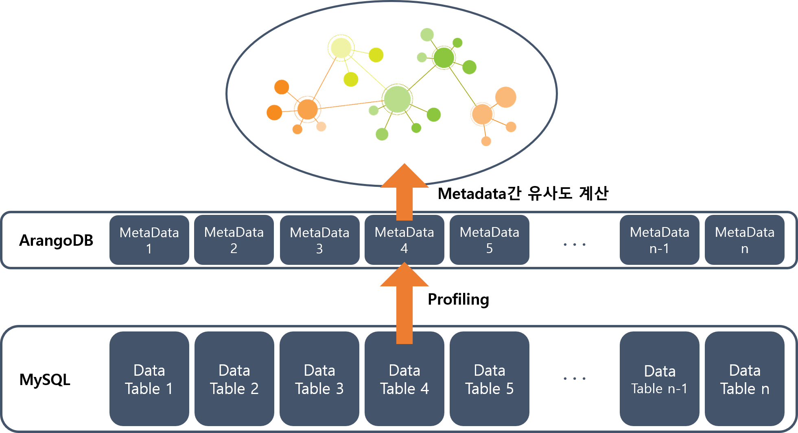

# Dev log

## Cleanliness
> 데이터 베이스에서 데이터 셋에 대해 페이징 작업을 수행.
> 
> 클리니스를 수행 후 프로파일링에 데이터를 데이터프레임 형태로 넘겨줌
1. 수치형 데이터
> SQL문으로 IQR 계산 후 outlier 제거
> 텍스트 형태로 들어오는 수치형 데이터 타입 변경
2. 날짜 데이터
> 칼럼명에 date가 들어가 있는 경우에 대해 %Y%m%d로 형식 통일

## Profiling
> 페이징 작업을 거치기 때문에 증분 프로파일링 진행
> 
> **증분 프로파일링**은 데이터 셋을 한번에 읽어올 경우에 발생할 수 있는 **메모리 초과를 방지**하기 위해 수행
### 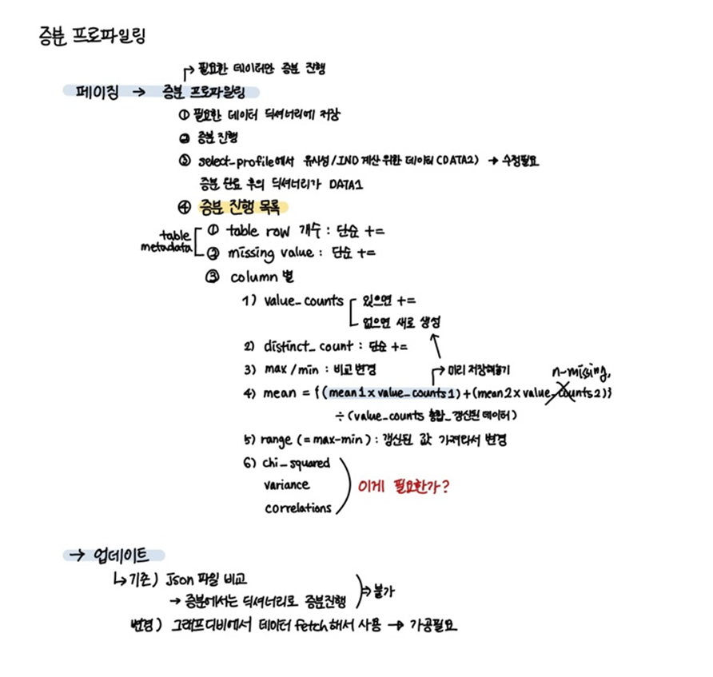
### 메타 데이터 항목
#### 1. 테이블
> 전체 row의 수
> null값이 들어있는 row의 수
> 칼럼명
#### 2. 칼럼
- 수치형
> mean, min/max, range, distinct value와 개수
- 범주형
> min/max length, distinct value와 개수
- 텍스트
> min/max length
> 
> keyword
>> 영어의 경우 전처리 및 토큰화 후 LDA 분석 수행.
>> 
>> 초기에는 LSA로 키워드 추출을 진행하였으나 LDA가 성능이 더 우수하여 알고리즘을 교체하였다.
### 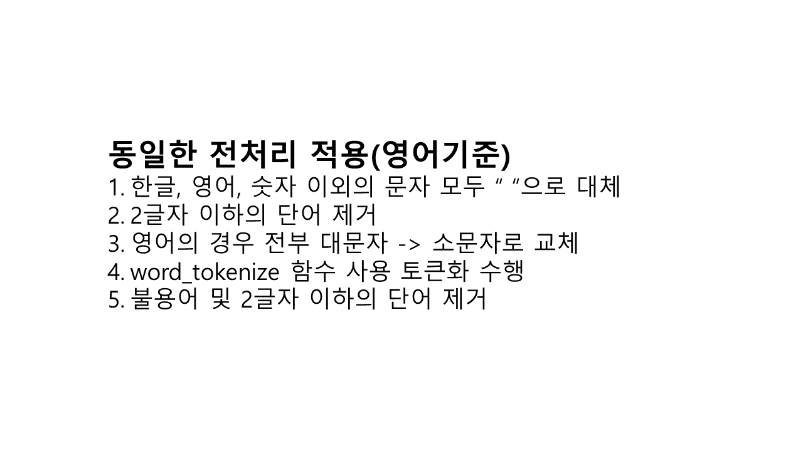
### 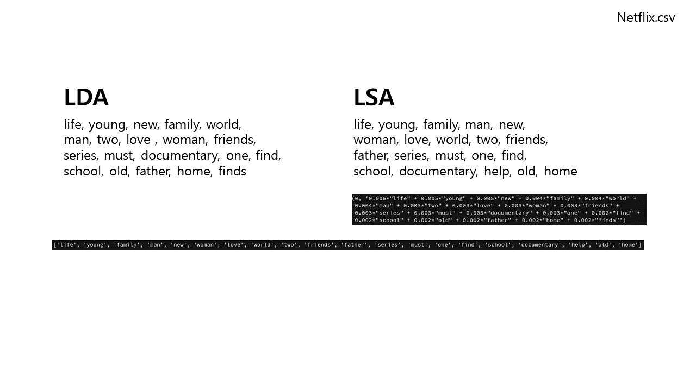
### 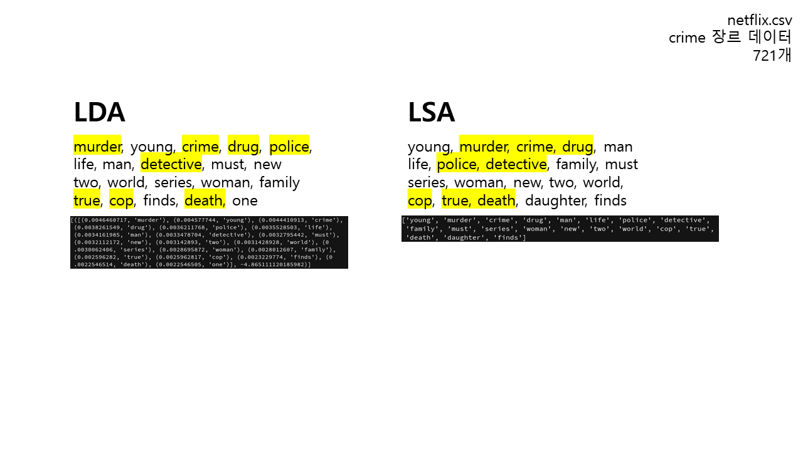
### 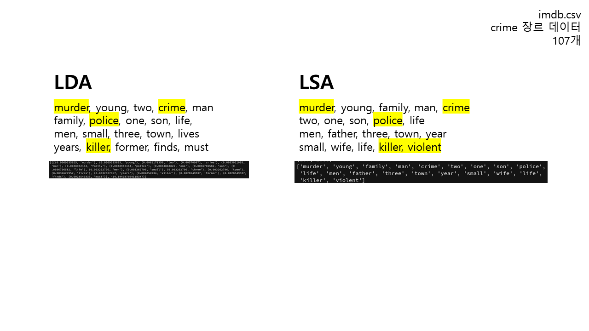
### 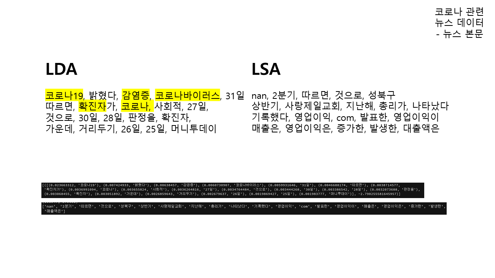
### 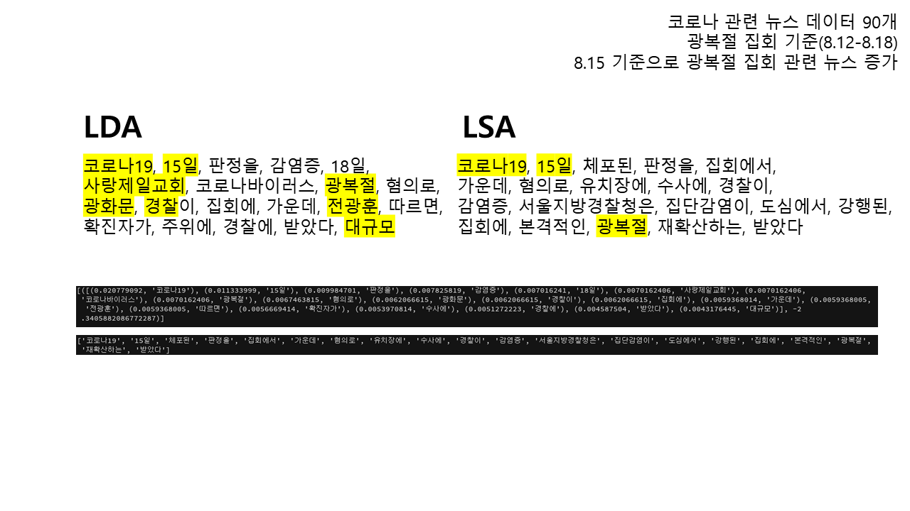
### 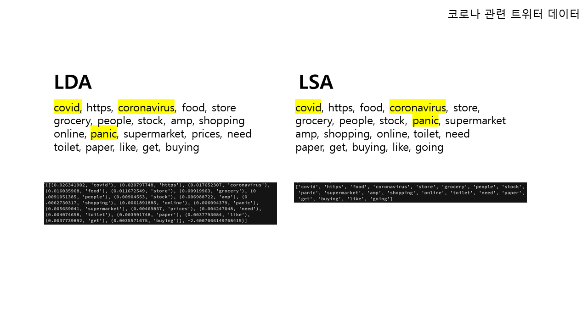
### 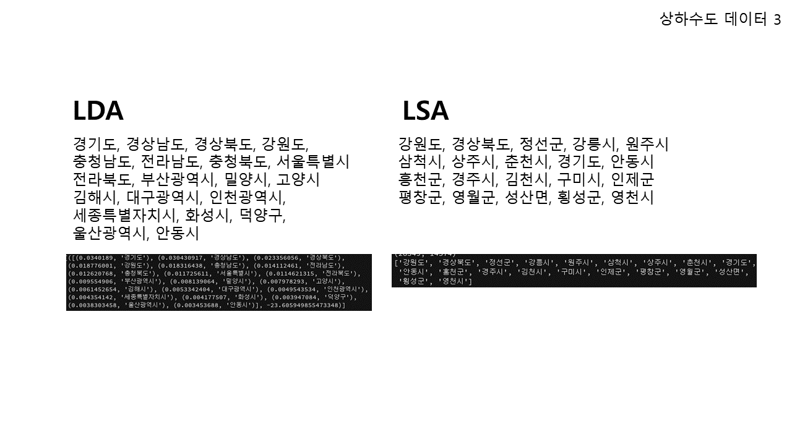
>> 한국어의 경우 형태소 분석을 통해 명사만 추출한 후 키워드 추출 수행. Konlpy의 Komoran과 soynlpy 라이브러리 비교 중.


### 유사도 계산
1. 수치형/범주형 데이터
> profile에 있는 데이터 빈도수를 바탕으로 (겹치는 데이터에서 작은 빈도수)/(전체 데이터의 합집합)으로 계산.
2. 텍스트 데이터
> 키워드를 가지고 자카드 유사도 사용

### Inclusion dependency 판별
#### (칼럼간 교집합)/(FK 테이블의 칼럼 집합-중복 제거) == 1일 경우 IND 관계
> from a to b: (a&b)/a == 1인 경우 IND, a가 FK b가 PK
> 논문에서 R[X]가 FK table이고 S[Y]가 PK table일 때 둘 사이에 IND가 성립할 때 이를 from R[X] -> to S[Y]라 나타냄

## Update
#### csv 파일을 사용자가 추가하는 것은 문제가 되지 않았으나 DB에서 직접 데이터 업데이트가 발생하는 경우(업데이트에는 삭제, 추가 등 모든 변경사항이 포함된다) 이를 알아내는 것이 관건이었다.

#### 다음과 같이 mysql의 **쿼리로그**를 긁어오는 방법을 제안하였고, DB관련 업데이트 사항에 대해서는 현재 이 방법을 사용하고 있다. 
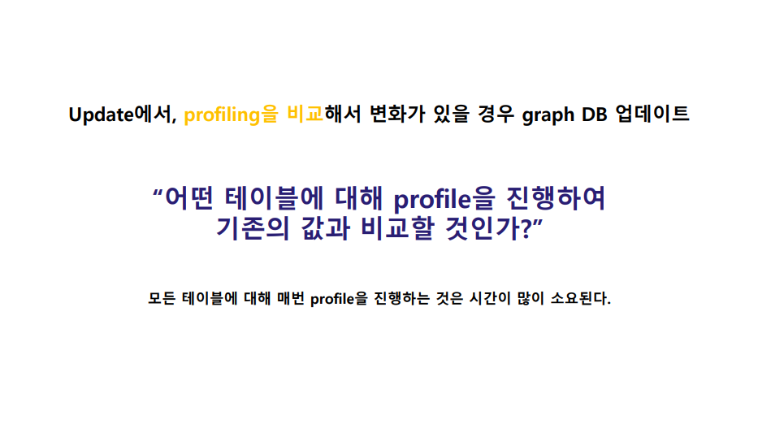
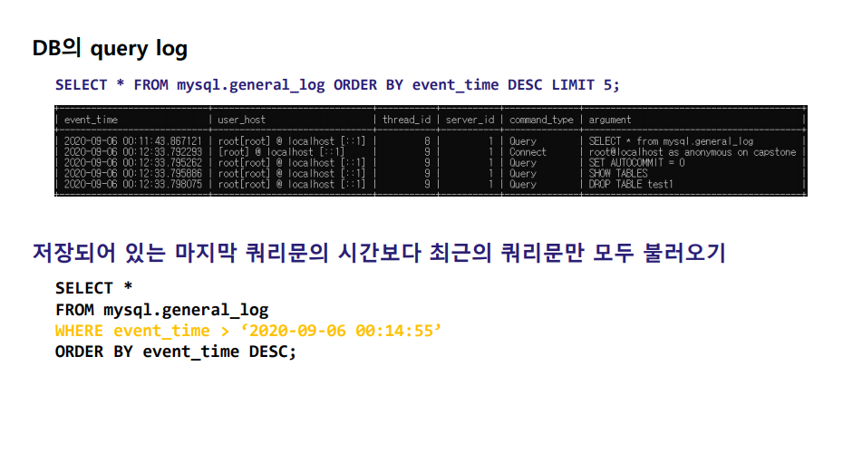
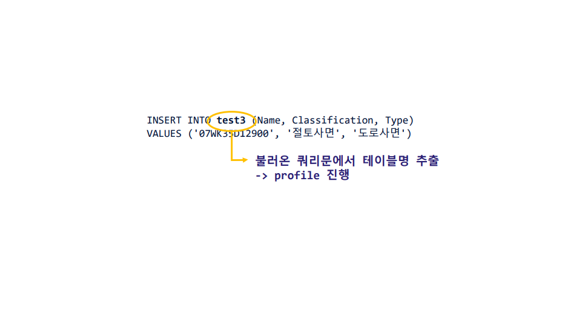

## Graph Build
#### pyArango 라이브러리를 사용하여 ArangoDB에 각 데이터 셋의 메타데이터 collection(table)과 relation을 생성하였다. relation을 가지고 그래프를 생성할 경우 DB에서 직접 생성하거나 각 collection과 relation 명을 클래스 명으로 가지는 파이썬 클래스를 생성해야했다. Collection명과 relation명을 변수로 받아오기 때문에 각 이름을 클래스 명으로 가지는 클래스를 생성하는 것이 불가능하였다. 이를 해결하고자 다음과 같은 이슈도 올렸으나 해답을 얻지 못하였다.
[ArangoDB-Community](https://github.com/ArangoDB-Community/pyArango/issues/191)
#### 파이썬과 달리 자바 라이브러리에서는 이러한 과정 없이 생성하는 것이 가능하였다. 그래서 그래프 생성을 자바로 연동해서 시행하였다.그래프 생성까지는 성공하였으나 이를 사용자에게 어떻게 보여줄것인지가 의문이였다. UI를 개발하기로 결정하기 전, 그래프를 이미지로 제공하기로 결정했고, Graphviz를 사용하였다.
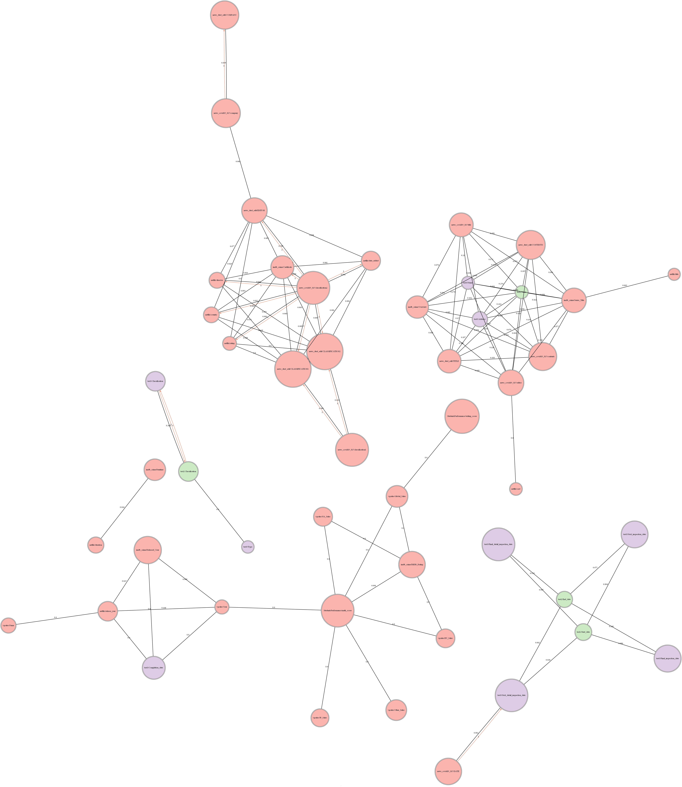
### Graphviz에서 그래프 생성을 위해 사용되는 데이터는 relation에서 AQL을 사용하여 가져온 json 형식의 데이터였기 때문에 자바를 사용하여 ArangoDB에서 그래프를 생성하는 과정은 삭제하게 되었다. 후에, UI 개발을 하면서 이미지 형태인 graphviz대신 networkx를 사용하여 그래프를 가공하였고, 데모는 다음과 같다.
### [demo](./image/networkx%20demo.mp4)

## UI
### 초기 디자인
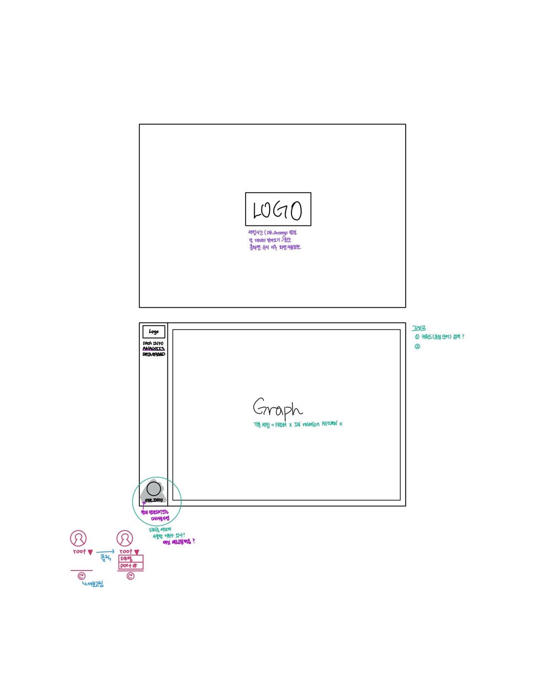
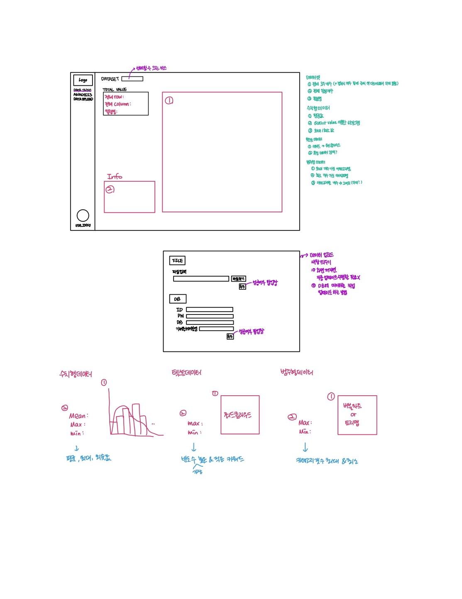

